**隧道衬砌原位制备应变传感器的方法、设备及无线测量系统**

**摘要：**本发明涉及一种混凝土结构上的原位制备应变传感器的方法、设备及无线测量系统，旨在优化结构健康监测的效率和准确性，并实现隧道结构的无线测量。通过在混凝土结构内部或表面原位制备应变传感器，解决了现有技术中应变传感器与混凝土粘结界面强度不足、传感器尺寸与混凝土构件尺寸不匹配的问题。此外，该方法允许根据具体的测量需求，灵活设计和配置传感器的形状和尺寸，从而提高测量的灵活性和适应性。传感器制备完成后，可直接在原位集成物联网（IoT）接口，实现数据的即时采集和远程上传，支持实时数据分析和结构健康状态的动态监控。本发明的应用，不仅提高了混凝土结构监测的可靠性和效率，还为结构健康监测领域带来了创新的技术解决方案。

此外，该方案的实施为混凝土结构健康监测提供了一种更加可靠、经济且易于实施的新途径，对保障结构安全和延长服务寿命具有重要意义。

**创新点：**

1. 在混凝土表面（或者内部）原位制造应变片。
2. 基于增材/减材制造技术的原位应变制备方法。
3. 应变片与天线复合的应变监测制备方法与应用系统。
4. 隧道无源无线的管片监测方法。
5. 隧道变形的全场颜色标识方法。

拟深圳预审分类：

| G01S | 互联网 | 无线电定向；无线电导航；采用无线电波测距或测速；采用无线电波的反射或再辐射的定位或存在检测；采用其他波的类似装置 |
| --- | --- | --- |
| G06T | 互联网 | 一般的图像数据处理或产生〔6，2006\.01〕 |

1. **背景：**

**背景技术1：**混凝土及混凝土结构的耐久性问题，力学性能问题，服役问题。混凝土的耐久性和力学性能直接影响到混凝土结构的安全、稳定和长期服役能力。混凝土结构在长期承受荷载、环境侵蚀、温度变化等因素的影响下，会出现裂缝、腐蚀、疲劳等一系列耐久性和力学性能问题。这些问题不仅降低了结构的使用寿命，也增加了维护和修复的成本。因此，对混凝土结构进行有效的应变监测，以早期识别结构性能下降或损伤，成为了保障结构安全和延长服务期限的关键手段。

**背景技术2：**常规的应变片检测技术，所应用的应变片，以及应变片的安装施工过程，以及所存在的弊端。在混凝土应变监测领域，最常用的方法是采用电阻应变片，通过采集传感器一段时间中的应变变化，计算出结构的应变。其具有灵敏度高、成本低的优点，易于实现结构的多点同步监测。此外，目前使用较多的还有光纤类应变传感器。但光纤传感器易受到高温与腐蚀环境的影响，虽比传统电阻应变片更加坚固但同样易断裂，故须对其提供额外的不影响光传输以及弯曲光纤的保护措施。此外还有振弦式应变计使用较多，通过在钢筋两端张拉一根钢弦，在钢筋产生应变时，钢弦的谐振频率发生变化，通过测量钢弦谐振频率的变化测出结构的应变，但该测量方式成本较高。

在实际工程应用上，由于环境适用性与使用成本等原因，电阻式应变片依旧是使用最广泛的应变传感器，但由于传统的金属应变片依旧存在工序繁琐的问题，其复杂的安装过程、环境适应性差、测量精度有限和灵活性不足等问题限制了其在混凝土结构健康监测领域的广泛应用和效能，因此开发新的应变传感器安装方法，简化安装流程是十分必要的。传统金属应变片工序繁琐的一个原因是其与混凝土界面粘结性较差，需要通过刷涂多层胶体来粘贴应变片。故为了简化应变片安装工序，使用与混凝土材料具有良好界面粘结性的新材料来开发新型应变传感器亦是十分必要。

总结，现有应变片存在的三个重要的问题：

* 应变片的体积相对混凝土而言较小。在混凝土结构中，单个点位的变形不足以说明混凝土构件整体的变形。
* 应变片是粘在混凝土表面上的，需要使用胶水固定，胶水受混凝土特殊环境中的温湿酸碱的影响，耐久性差。
* 由于胶水也具有一定的变形作用，导致混凝土的变形不能完全的传递到应变片上，进而检测不准确。
1. **本发明的方法**

**1\.方法阐述。**

本发明核心在于采用**原位制备**技术。即直接在混凝土结构上形成应变片，采用导电材料（如掺入银粉/铜粉的环氧树脂胶）以提高应变传感器的强度和灵敏度，并采用绝缘材料（如环氧树脂）作为导电胶的基材，以提高导电胶的原材料与水泥基材料的良好兼容性，且由于材料本身无固定形状，因此适用于各个监测点位。同时，将物联网（IoT）模组、电源和导线等必要的电子组件也在相同的位置原位安装，实现应变数据的实时采集和上传，从而提高结构健康监测的实时性和准确性。

**2\.方法步骤：**

**（1）选择合适的导电材料及绝缘基材：**针对传统的电阻式应变片脆弱易损坏的缺点，本发明选择具有良好的机械性能、热性能与化学性能，并且与各种材料具有良好的兼容性的绝缘材料作为基材（如环氧树脂）；为了保障导电胶材料不易因碰撞发生损坏、提高材料在应用过程中对环境的适应性，本发明选择具有良好力学性能的导电材料（如铜银粉的导电胶水）作为原位制备导电胶应变片的制备材料。

**（2）原位制备应变传感器：**首先对混凝土结构的目标表面进行准备，包括清洁和平整处理，以确保传感器的良好粘贴和信号传输。利用先进的制备技术，如增材制造（3D打印）或减材制造（如CNC铣削），使用前述导电材料直接在混凝土结构表面或内部，按照预定的形状和尺寸原位制备应变片。通过使用新材料和新技术提高这一步骤能够确保应变片与混凝土之间的精密配合和优良的粘接性能，从而提高监测的可靠性和精度。

**（3）安装导线、物联网模组：**将物联网模组连接电源（如电池），通过导线与制备好的应变传感器相连。物联网模组负责收集传感器的数据，并通过无线网络发送。根据需要布置导线，以确保电源与传感器及物联网模组之间的有效连接。在应变片制备的同一过程中，将物联网模组、电池和导线等电子组件一并安装在混凝土结构中。这些组件的原位集成不仅简化了安装流程，而且减少了因外部因素导致的损伤或故障，提高了系统的稳定性和长期运行能力。

**（4）数据上传与监测系统集成：**通过物联网模组，采集到的应变数据可以实时传输至云平台或数据处理中心。允许工程师和管理人员即时接收和分析结构的应变信息，快速做出响应，以预防潜在的结构问题。根据实际监测数据和分析结果，进一步优化应变片的布局和监测策略，确保覆盖所有关键区域，提高监测的全面性和准确性。监测系统可配置报警阈值，当数据指示潜在问题时，系统会自动警告相关人员。大幅度提升了混凝土结构应变监测的效率和效果，通过原位制备应变片和电子组件的集成安装，实现了高精度的实时监测。

**3\.特点与优势：**

* 精确与灵活的应变监测：本发明方法允许按需制备**形状和尺寸可定制**的应变传感器，提高监测的准确性和适用性。
* 提高粘结强度：原位制备的应变传感器与混凝土之间具有**更强的粘结强度**，确保长期稳定的监测性能。
* 提高应变传感器强度：所选导电胶应变片的制备材料具有良好的力学性能，在应用过程中对环境具有广泛的适应性。
* 实时数据远程监测：集成的物联网模组使数据能够实时上传并远程监控，大大提高了监测效率和及时性。
* 经济可靠、便于实施。该方案的实施为混凝土结构健康监测提供了一种更加可靠、经济且易于实施的新途径，对保障结构安全和延长服务寿命具有重要意义。
1. **实施方案**

**实施方案1：基于3D打印增材制造技术的原位制备应变片技术**

增材制造设备，如使用3D打印喷嘴，在未凝固的混凝土表面（图1a）挤出材料，形成应变片。这种方法不仅能够原位制备应变片，还能根据结构的实际监测需求定制应变片的形状和尺寸，提高了监测的灵活性和适应性。

进一步地，可以使用3D打印喷头，在未凝固的混凝土内部制备应变片，如图1b.

更优的是：由于混凝土仍处于固化过程中，与导电胶材料同步固化，界面粘结的更牢固。通过电镜技术可以发现两种材料之间有化学粘结。这是成品的金属应变片在混凝土等材料上的粘结所达不到的效果。

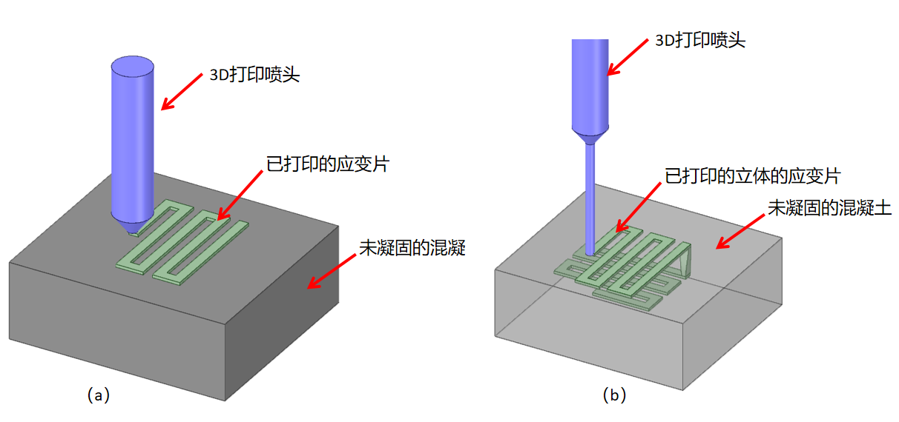

图 1 （a）在未凝固的混凝土表面布置应变片，（b）在未凝固的混凝土内部3D打印应变片

**实施步骤：**

1. 设计阶段：首先，基于监测需求，使用专门的软件设计应变片的具体形状和尺寸。这一步骤允许根据结构的特点和应变监测的具体要求，定制化设计应变片。
2. 3D打印制备：利用3D打印机根据设计直接在指定的混凝土表面制备应变片。打印过程中，可以实时调整参数，以适应复杂的表面形状或结构特征。
3. 集成电子组件：在应变片制备完成后，立即在原位安装必要的电子组件，包括物联网（IoT）模块、电池、导线等，以实现应变数据的实时采集和远程传输。这一步骤确保了监测系统的即时运行和高效性。
4. 测试与调整：完成安装后，进行系统测试以验证应变片的功能和整个监测系统的准确性。必要时，对系统进行调整，以确保最优的监测效果。

可以通过对实际监测数据的分析和处理，如统计分析和异常检测等，来判断监测效果是否达到最优。当出现监测效果不佳的情况时，可以通过实际监测数据和分析结果来评估，确定具体的调整措施。例如，如果监测覆盖范围不够广，可以考虑调整打印参数，如打印速度和层间距，以增加应变片的数量和覆盖范围。如果监测精确度不够高，可以尝试更换材料，如选择更具导电性的材料来提高监测精确性。同时，也可以通过改变设计方案来提高监测效果，如调整应变片的形状和尺寸来适应不同的结构特点。另外，如果出现监测效果不佳的情况，可以考虑采用减材制造技术来处理增材技术制造的混凝土，以提高粘结性能和监测效果。这可以通过选择更合适的材料来实现，如在增材制造的混凝土表面涂覆一层导电胶材料，再使用减材制造技术来精确地制作应变片。总而言之，根据实际情况，可以采取不同的调整措施来确保最优的监测效果。

**实施方案2：基于减材制造技术的原位制备应变片技术**

本方案探讨了一种利用减材制造技术在混凝土结构上原位制备应变片的方法。与增材制造技术不同，减材制造涉及从混凝土结构表面或内部去除材料，再加入导电胶材料以形成应变片的过程。此方法特别适合于在已有的结构中添加应变监测系统，或者在结构的特定部分需要特别细腻和精确的应变监测时使用。通过使用精细控制的减材设备，如激光刻蚀机或CNC（计算机数控）的钻头/铣头，可以在混凝土表面或内部精确去除材料，形成预定形状和尺寸的应变片。这一过程允许高度定制化的应变片设计，适应特定监测需求，并保持与混凝土的优良接合性能。完成应变片的形成后，可将物联网模组、电池和导线等必要的监测组件集成到刻蚀出的空间内，实现应变数据的实时监测和远程传输。

**优点：**钻头/铣头处理过的混凝土，具有非常粗糙的表面，所使用的导电胶材料充分地填充了粗糙的界面，这些粗糙的界面大大增强的混凝土与应变材料之间的粘结性能。同时，胶材是填充进混凝土中的，因此应变片是嵌入进混凝土结构中，多个面受到了混凝土的包裹，具有更好的形变传递。

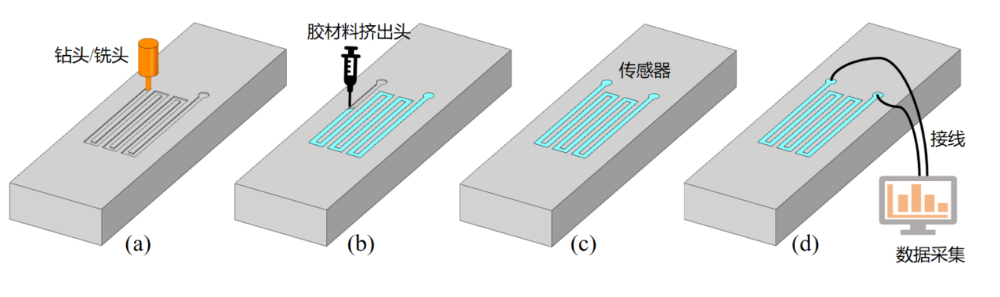

图 2在已凝固的混凝土表面钻蛇形线制备应变片

**实施步骤：**

1. 预先分析与设计：在开始制备前，对混凝土结构的特定部位进行详细的分析，确定应变片的最佳位置和形状。其中，可以通过考虑以下几个方面的因素来选择最佳位置和形状，如混凝土结构的受力情况、应变监测的目的和需求、混凝土表面的平整程度等。一般来说，使用结构仿真技术，最佳位置应该是混凝土结构的受力集中区域，并且形状应与受力情况相匹配，以保证应变片可以准确捕捉结构的变形情况。同时，如果混凝土表面不够平整，可能需要针对具体情况进行一些调整，以保证应变片的精确性。再利用计算机辅助设计（CAD）软件，设计应变片的精确尺寸和轮廓。
2. 选择合适的减材设备：根据混凝土的性质和应变片的设计要求，选择最合适的减材设备，如激光雕刻机、CNC铣床等。其中，可以考虑以下方面的因素来选择最合适的减材设备，如混凝土的性质（硬度、厚度等）、应变片的尺寸和形状、减材设备的精确度等。一般来说，最关键的标准是减材设备的精确度，因为它直接影响应变片的精确度。同时，根据应变片的尺寸和形状，选择具有相应加工能力的设备，如激光雕刻机适合制备细小的应变片，而CNC铣床则适用于制备较大的应变片。这些设备能够精确地去除混凝土材料，形成预定的应变片形状。
3. 减材制备过程：使用选定的减材设备，在混凝土结构的指定位置精确去除材料，过程中需密切监控设备的操作，确保精确度和形状的准确性。
4. 在去除的位置再注射导电胶材料，形成应变片。
5. 安装监测组件：在应变片制备完成后，立即在所创建的空间内安装必要的监测组件，包括传感器、电子线路、IoT模块等。这些组件负责捕捉应变数据，并实现数据的实时传输。
6. 系统测试与优化：完成所有安装后，进行综合测试以评估应变片和整个监测系统的性能。根据测试结果调整和优化系统设置，以确保监测的准确性和效率。

**实施方案3：应变片的绝缘隔离方法**

由于混凝土具有一定的导电性。所以需要将导电胶的外层涂覆一层绝缘的纯环氧树脂胶。最合适的是选用同样的树脂材料。由于两种胶均是在未凝固状态，所以绝缘胶与导电胶的粘结会非常好，比使用成品应变片更优。

**对于已经固化的混凝土，**可以使用以下方法，如图3。

**实施步骤：**

1. 打槽:在开始制备应变片之前，对混凝土结构的目标表面进行清洁并确保表面平整，以确保后续的涂覆和固化过程顺利进行。使用适当尺寸的钻头或铣头，在混凝土表面打出相应的槽，槽的尺寸应适合容纳后续涂覆的绝缘胶和导电胶。
2. 先刷一层绝缘胶: 将绝缘的纯环氧树脂胶涂覆在打好的槽内，确保覆盖整个槽的表面。绝缘胶的选择与导电胶相兼容，并且在未固化状态下与导电胶具有良好的粘结性。
3. 再加入导电胶: 在绝缘胶涂覆后，将导电胶填充至槽内，确保完全填充并且与绝缘胶紧密贴合。
4. 最后再刷一层绝缘胶: 在导电胶填充完成后，再次涂覆一层绝缘的纯环氧树脂胶，覆盖整个槽的表面，以确保导电胶完全被绝缘,且绝缘胶与导电胶同时完成固化，确保两者之间的粘结性能和绝缘性能。

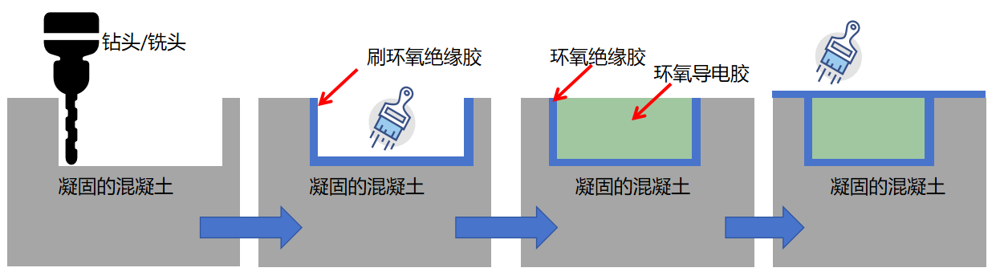

图 3在已凝固的混凝土表面面制备具有绝缘层的应变片

**对于未凝固的混凝土，**可以升级3D打印喷头，使之可以在外层挤出绝缘的胶，如图4。这样，在未凝固的混凝土中，所制备的应变片仍具有一层绝缘层。绝缘树脂、导电树脂，以及混凝土，三者同步进行固化，相互之间可以取得优异的粘结。

**实施步骤：**

1. 设计绝缘层的模型：在计算机辅助设计（CAD）软件中设计绝缘层的模型，确保其与混凝土结构的表面相匹配，并具有所需的形状和尺寸。
2. 准备3D打印设备：确保3D打印设备处于良好的工作状态，并根据设计的模型和材料选择调整设备参数，包括打印速度、层厚、温度等。
3. 打印绝缘层与导电材料： 使用3D打印设备，在混凝土结构的表面挤出绝缘材料，形成绝缘层的结构。根据设计的模型，精确控制打印喷头的移动路径和材料的喷射量，确保绝缘层的形状和尺寸与预期一致。
4. 调整和优化：在打印过程中，根据需要对设备参数进行调整和优化，以确保绝缘层的质量和精度。定期检查打印过程中是否出现问题，并及时进行调整，确保绝缘层的均匀性和完整性。

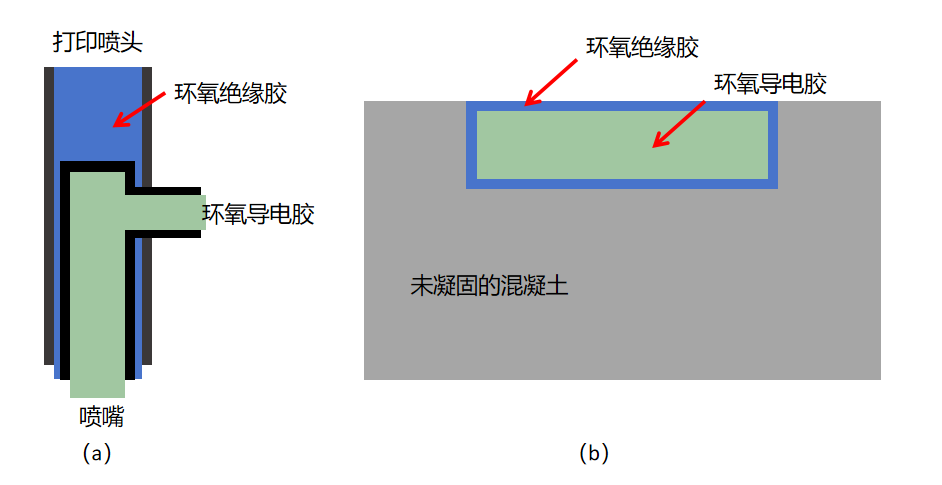

图 4 （a）双材料打印的打印喷头，（b）在未凝固的混凝土内部制备带绝缘层的应变片

**实施方案4：应变片的实时电气连接的方法，以及无源无线供电数据传输方法。**

在原位制备应变片的同时，还使用自动机构将应变检测的无线芯片集成到混凝土表面（或者内部），并可以使用相同的导电胶材材料（或者不同的导电胶材料）制备圆状射频天线（或者其他形式的天线）。然后通过射频发射等处理，可以实现整个监测系统的供电及数据传输。

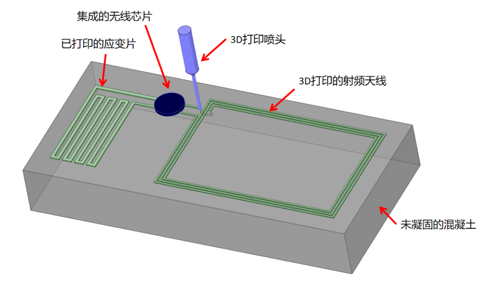

图 5原位制备应变片及射频无线传输系统

更进一步地，这条射频天线也是应变片的一种，在射频天线收到无线信号的同时，系统接收到无线的电力供应，并同时计算出射频天线的阻抗变化，获得混凝土的应变值，再通过射频天线向外部设备发送数据。

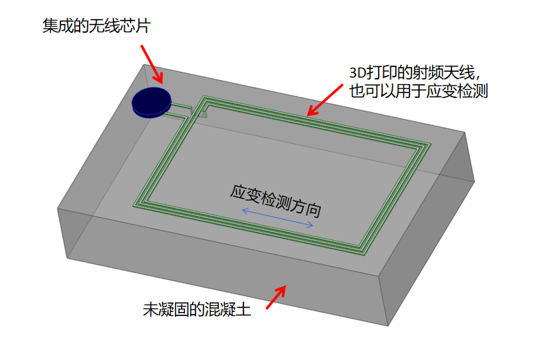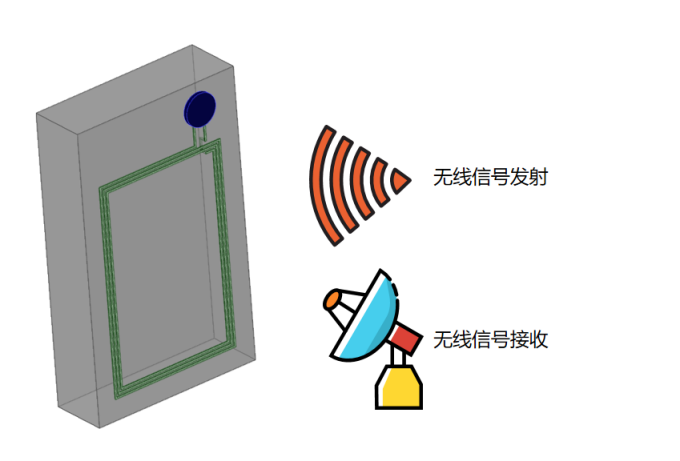

图 6（a）应变片与射频天线复合的系统，（b）信号发射及接收示意图

再进一步地，不使用处理器，仅使用线圈。线圈直接感应无线信号（即电磁波），不同的形变条件下，线圈的电阻不同，对无线信号的反馈能力不同，因此，无线信号接收到的就不同，则可以分析出被测混凝土的形变。

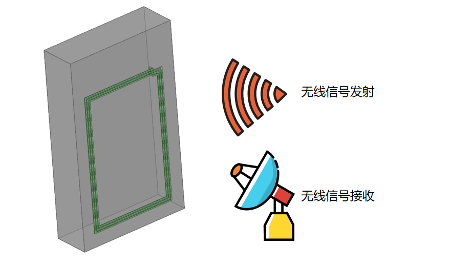

图 7 无线无源无芯片的混凝土形变测量方法

**实施方案5 结合无源无线的隧道管片巡检方法。**

如下图所示，在城市轨道交通隧道中，管片的变形检测非常重要。结合上述方法在管片表面制备无源无线传感器。

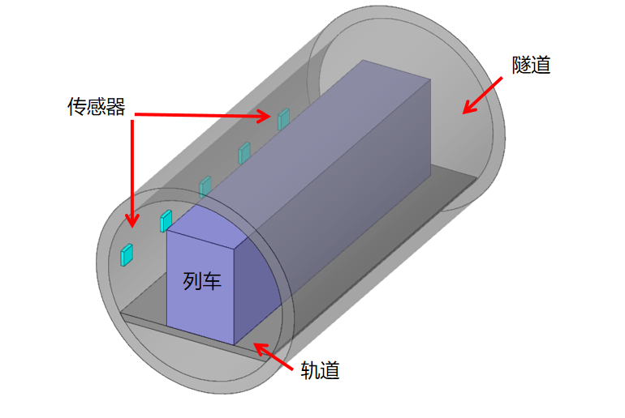

图 8无线无源的隧道管片形变测量方法

具体实施步骤如下：

1. 安装无源无线传感器系统：在隧道内壁的管片表面上安装无源无线传感器系统，用来捕捉管片的变形信息。安装位置应该考虑到最大程度地覆盖管片表面，以确保检测的全面性和准确性。
2. 安装射频扫描系统：在列车壁上安装射频扫描系统，向管片表面发送射频信号。选择合适的安装位置，以确保能够有效地发送信号到管片表面，并收集相应的响应数据。
3. 实时检测：当列车经过时，射频扫描系统会向管片表面发送射频信号。管片上的无源无线传感器系统接收到射频信号后，会收集管片的变形信息，并将收集到的数据传输回射频扫描系统，实现对管片变形的即时检测。

**实施方案6 基于变色外观的隧道管片应变直观显示系统**

选用的导电材料与油漆等保护材料相兼容，喷涂在隧道内面，在隧道内部实现大尺寸、大量的布置应变传感器。更多的导电的天线环实现了能量收集，驱动隧道内部的其他传感器及相应电路的工作及通信。

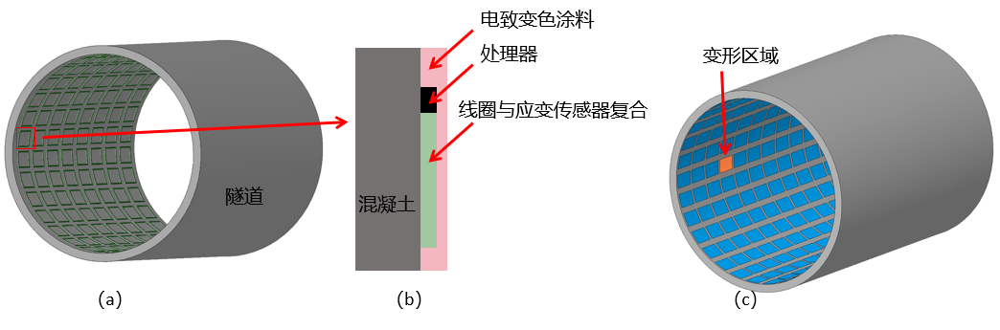

图 9基于无线无源的隧道形变的颜色感应方法。（a）隧道内部的传感器排列，（b）传感器区域的多层结构，（c）使用图形显示的隧道管片变形区域。

**实施步骤**

1. 隧道管片施工完成后，在内壁进行大量的无线无源传感器的印刷。
2. 在传感器上所检测的区域（即传感器所在区域），即在传感器上面，再涂一层受电变色的涂料，例如现有的电纸技术/变色玻璃技术等。这种颜色可以长时间留存。
3. 通过无线射频技术对传感器进行基本标定，以及设定不同的形变阈值。
4. 当列车经过时，发射无线信号，驱动所有的传感器进行形变检测。
5. 当检测达到指定的阈值，电路驱动显色涂料显示不同的颜色。方便人工进行快速判别。
6. 进一步地，使用相机对隧道进行拍照，然后使用图像处理技术进行迅速识别。

实施方案6：应变片的形状设计需求及常用的形状，实现多组应变片，应变检测矩阵

应变片的形状设可以适应不同监测需求和混凝土结构的特点，提前根据结构进行力学特性的仿真以及易损性的分析，确定力学性能监测的关键位置，并根据受力特性进行设计不同的形状，用于优化应变监测的覆盖范围和精度，实现更为复杂的应变检测矩阵。

该方案包括标准形状（如直线型、环形或网格型）的应变片，以及根据特定应用需求定制的形状。通过精确控制应变片的形状和布局，可以实现对结构应力分布的详细映射，提高损伤检测的灵敏度和准确性。

此外，还考虑在一个结构中实现多组应变片的协同工作，构建一个应变检测矩阵。这种矩阵可以提供全面的应变监测覆盖，使得监测系统能够精确捕捉到结构在不同条件下的应变响应。通过这种方式，监测系统不仅能够检测出结构的整体应变状态，还能够识别出局部应变集中区域，为结构健康评估和维护决策提供更详细的信息。

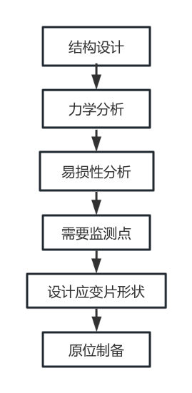

图 10原位制备应变片及射频无线传输系统

**实施步骤：**

1. 形状设计：根据混凝土结构的特点及监测目标，分析应变监测的需求。设计适合的应变片形状，如直线型、环形、网状等，以及特定形状以匹配结构特征和应变分布。
2. 多组应变片配置：在混凝土结构上配置多组应变片，根据结构的应力分布和潜在薄弱区域进行优化布局。设计应变片之间的间距和排列方式，以形成有效的应变检测矩阵。具体的布局设计，可以参考以下两种方式：
3. 参考以往设计的案例：通过借鉴以往类似项目的设计案例，结合当前的具体情况进行分析。通过对以往案例的研究和总结，可以确定适合本次项目的目的和需求，并构建多套方案。这些方案可能是根据以往案例的经验和成功做出的调整和改进，以满足当前项目的要求。这种方法的优势在于可以借鉴过去的成功经验，缩短设计周期，降低风险。
4. 利用相关分析算法或相关组合算法：这种方式则是利用相关的分析算法或组合算法，对可能的布局方式进行模拟和评估。通过算法的运算，可以模拟出所有可能的布局效果，并对这些效果进行评估，找出最优的布局方式。这种方法的优势在于可以通过数学模型和计算方法全面地考虑各种因素，找到最佳的设计方案。然而，这种方法可能需要较强的算法和数学建模能力，并且可能需要大量的计算资源和时间。
5. 材料选择与制备：选择合适的材料制备应变片，确保其在混凝土结构中的良好性能和长期稳定性。考虑使用先进的制备技术，如增材制造或减材制造，以实现复杂形状的应变片。
6. 集成与连接：将设计好的应变片集成到混凝土结构中，并确保它们之间及与数据采集系统之间的有效电气连接。采用高质量的连接技术，保证数据的准确传输。
7. 系统测试与优化：完成应变片的安装后，进行系统级测试，评估应变检测矩阵的性能。根据测试结果，对应变片的布局或形状进行调整优化，以达到最佳的监测效果。

**专利对比：**

现有的原位制备应变片有两个专利，被测试的材料均是在固体材料表面制备，使用的技术为**转印蚀刻**/3D打印。

* + - 1. 与本发明不同的是，本发明需要将被测试的材料进行处理，以增强应变片与被测材料之间的粘结，保障变形的传递。这是通过传统的应变技术无法借鉴到的，是具有创造性的。
			2. 同时还可以将应变片设计为天线的形状，实现数据传输与应变检测的复合功能。

| **名称** | **主图** | **主要内容** | **区别** |
| --- | --- | --- | --- |
| 用于结构件应变测量的共体化裂纹传感器及原位转印制造方法 |  | CN202310792013\.6一种用于结构件应变测量的共体化裂纹传感器及原位转印制造方法，传感器包括粘附在待测表面的NOA紫外线固化剂，NOA紫外线固化剂上表面粘附具有网格结构的导电敏感材料，形成导电网络，导电网络上分布有定域生成裂纹；制造方法先进行压印模具制备及表面处理，然后进行 PDMS基底表面处理，再进行导电敏感材料的约束印刷，然后产生定域生成裂纹，再进行原位转印工艺，形成共体化裂纹传感器；本发明传感器更加灵敏、性能更加稳定，导电网格直接粘合在待测表面，传递应变率更高。 | 对所测量的目标材没有处理处理。本发 |
| 一种异形金属基底上的应变传感器芯片及其原位制备方法 |  | CN202210077772\.X本发明提供一种异形金属基底上的应变传感器芯片及其原位制备方法，将异形金属构件作为金属基底，在金属基底的易变形部位上原位制备薄膜敏感栅，包括：设置于金属基底上的绝缘隔离层；设置于绝缘隔离层上的薄膜应变栅层；设置于薄膜应变栅层上方的绝缘保护层，绝缘保护层覆盖薄膜应变栅层的应变栅区域，同时露出薄膜应变栅层的引线电极；当异形金属构件发生变形时，薄膜应变栅层的电阻值会产生变化，通过薄膜应变栅层电阻值的变化能得到异形金属构件所受的物理量。本发明基于异形金属基底上原位制备，能够实现机械传动部件应变/扭矩的原位、无损伤测量，且省去了传统粘结剂的使用，在高湿、盐雾、霉菌等海洋环境和太空辐照等环境具有更高的可靠性。 |  |
| 应变片制备方法及具有其的应变片及霍普金森杆 |  | CN201910287272\.7应变片制备方法及具有其的应变片，该方法包括如下步骤：在目标面上打印应变敏感层；固化所述应变敏感层；在所述应变敏感层的端部布设导电部件；在所述应变敏感层上设置聚合物薄膜层，以使所述聚合物薄膜层覆盖所述应变敏感层与所述导电部件的连接点以及应变敏感层。该制备方法适合平面和曲面等多种目标面的制备，能够减少在目标面制备应变片的时间，提高制备效率，同时能够将应变片准确地制备在目标位置且粘结牢固，保证在目标表面制备的应变片整体性能稳定、灵敏度高，且制备过程中不会出现气泡，制备过程干净整洁，该方法可用于制备较大范围尺寸的应变片，应用更加广泛。 |  |

