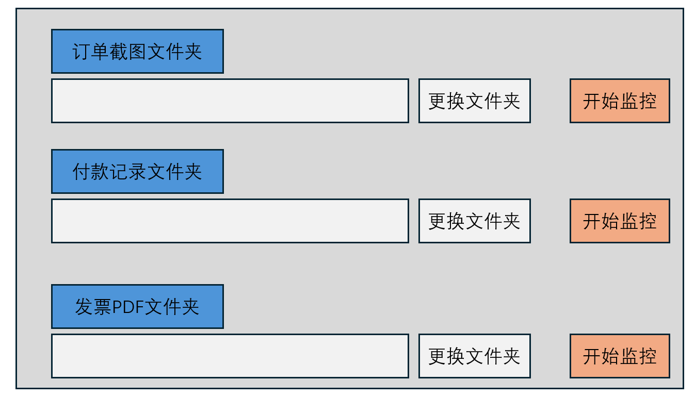

<div align="center">
  <h1>🧾 票单款智能监控与重命名工具</h1>
  <p><b>基于 LLM 与 OCR 的报销凭证自动化整理助手</b></p>
</div>

## 📖 项目简介

**为什么开发这个小工具？**

在日常工作和报销流程中，我们经常需要处理大量的“订单截图”、“支付截图”以及“发票PDF”。手动核对金额、日期、商品名称并逐一重命名，不仅枯燥乏味，还容易出错。
这个项目旨在通过一个小巧的本地监控程序，结合当前强大的大语言模型（LLM），**全自动地**识别您保存到文件夹里的截图和发票文件，并立刻将其重命名为规范、清晰的格式（如 `2026-01-04__苹果鼠标__¥399.00.png`）。

我们希望这个小工具能帮您从繁琐的文件整理中解脱出来，把时间留给更有价值的事情。

---

## 🖼️ 软件界面



> **提示**：工具界面简洁直观，分为**订单截图**、**付款记录**、**发票PDF**三个独立监控模块。您可以分别指定文件夹并独立启动监控。

---

## ✨ 核心特性

- 🤖 **智能图像与文档识别 (VLM / LLM)**
  - 默认支持具备视觉能力的多模态模型（OpenAI 兼容接口，支持 DeepSeek, Kimi, Qwen, Doubao 等）。
  - 精准提取**订单截图**中的：日期、采购名称、实付金额。
  - 精准提取**支付截图**中的：日期、支付方式（含尾号）、支付金额。
  - 自动解析**发票PDF**中的：开票日期、发票金额。
- 👁️ **OCR 智能回退机制**
  - 如果您所选的模型暂时不支持直接输入图片（如遇到 `unknown variant image_url`），程序会自动调用本地的 Tesseract OCR 提取图片文字，再交由 LLM 进行结构化分析，确保流程不中断。
- ⚡ **无感后台监控**
  - 只需设置好“订单文件夹”和“支付文件夹”，点击“开始监控”后，工具会在后台静默运行。
  - 任何新保存到该文件夹的截图，都会在瞬间被自动处理并重命名。
- 🛡️ **安全与防冲突**
  - **防重复处理**：已经处理过或不符合条件的文件会自动加入忽略列表，不会被反复读取。
  - **防命名冲突**：如果同一天购买了同名商品，程序会自动追加序号（如 `商品-1`、`商品-2`），绝不覆盖您的重要凭证。
  - 规范的货币符号显示，自动统一 `CNY/RMB/￥` 为 `¥`。

---

## 🚀 快速上手

### 1. 配置文件 (`setup.ini`)

在运行程序或可执行文件前，请先在同级目录下编辑 `setup.ini` 文件。主要分为两个配置节点：

**订单截图配置 (`[order-llm]`)**
```ini
[order-llm]
watch_folder = D:\您的报销文件夹\订单截图
base_url = https://api.openai.com/v1  # 支持自定义兼容 OpenAI 的接口
api_key = sk-xxxxxxxxxxxxxxxxx
model = gpt-4o-mini
# provider = deepseek  # 可选：支持填写别名以自动补全 base_url (如 deepseek, kimi, qwen)
template = {date}__{item}__{paid}
tesseract_cmd = C:\Program Files\Tesseract-OCR\tesseract.exe  # 可选：用于不支持视觉模型时的 OCR 路径
```

**支付截图配置 (`[pay_llm]`)**
```ini
[pay_llm]
watch_folder = D:\您的报销文件夹\支付截图
base_url = https://api.openai.com/v1
api_key = sk-xxxxxxxxxxxxxxxxx
model = gpt-4o-mini
template = {date}__{method}__{paid}
```
*注：支付方式 `{method}` 会自动格式化，例如：“信用卡2322”或“微信”、“支付宝”。*

**发票PDF配置 (`[rep_llm]`)**
```ini
[rep_llm]
watch_folder = D:\您的报销文件夹\发票PDF
base_url = https://api.openai.com/v1
api_key = sk-xxxxxxxxxxxxxxxxx
model = gpt-4o-mini
template = {date}__{amount}
```

### 2. 运行程序

**方式一：运行 Python 源码**
```bash
# 确保安装了相关依赖 (如 watchdog, requests, pytesseract 等)
python app.py
```

**方式二：使用编译好的可执行文件**
直接双击运行 `dist/MonitorRenameTool.exe`，在弹出的界面中确认监控文件夹无误后，点击**“开始监控”**即可。

---

## 📁 运行产物说明

工具在运行过程中，会在当前目录生成以下文件以保证稳定运行：

- `watch_state.json`：持久化保存监控状态（记录已处理和忽略的文件），防止每次重启后重复处理。
- `watch.log`：运行日志文件，如果遇到网络异常或识别失败，您可以在这里查看详细原因。

---

## 🤝 写在最后

这只是一个为了解决日常痛点而编写的自动化小脚本。虽然目前功能还比较基础（主要聚焦于第一阶段的订单/支付截图重命名），但希望能为需要处理繁杂报销凭证的朋友提供一点点便利。

代码和逻辑难免有不够完善的地方，非常欢迎大家提出宝贵的建议或提交 PR 共同改进！